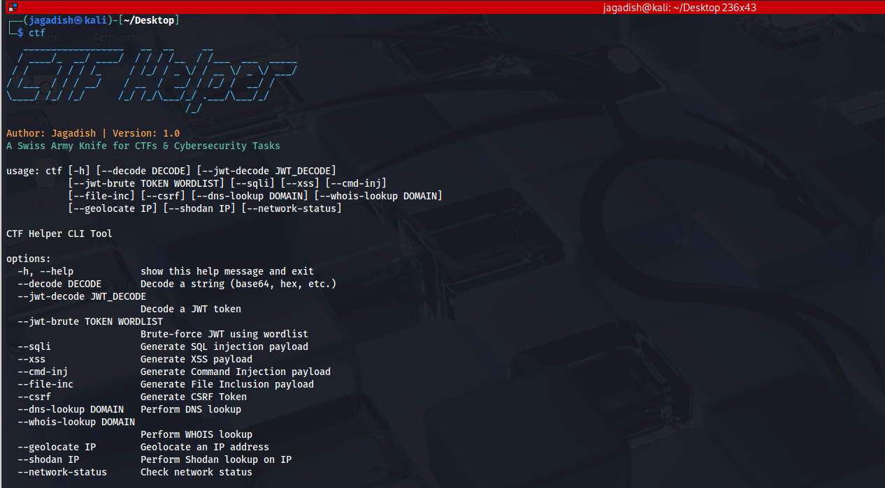

# CTF Helper

A Swiss Army Knife for CTFs & Cybersecurity Tasks.



---

## 🔥 Features

- 🧬 Base64, Hex, URL & other decoders

- 🔐 JWT decode & brute-force

- 🌐 Web exploits & common attack utilities

- 🌍 OSINT tools (GeoIP, Shodan)

- 🧰 Built for extensibility and modularity
---

## 🛠️ Installation

### 1. Clone the Repository

```
git clone https://github.com/jagdishtripathy/ctf-helper.git
cd ctf-helper
```
---------------
 ### 2. Copy Files to `/usr/local/bin`
```
sudo cp banner.py /usr/local/bin/
sudo cp ctf /usr/local/bin/
sudo cp -r modules /usr/local/bin
sudo cp README.md /usr/local/bin
sudo cp requirements.txt /usr/local/bin
sudo cp -r __pycache__ /usr/local/bin
```
### 3. Go to the `/usr/local/bin` Folder
```
cd /usr/local/bin
```
### 4. Make Globally Executable
```
sudo chmod +x *
```
### 5. Create a Python Virtual Environment
```
sudo apt install python3-venv -y
python3 -m venv myenv
source myenv/bin/activate
```
### 6. Install Requirements
```
pip3 install -r requirements.txt

```
You can now run the tool using ctf from anywhere.

### 🚀 Usage Examples

```
# Decode a base64 or hex string

ctf --decode SGVsbG8gd29ybGQh
```
### Decode a JWT token

ctf --jwt-decode eyJhbGciOiJIUzI1NiIsInR...
```
# Brute-force a JWT secret using rockyou.txt

ctf --jwt-brute eyJhbGci... /path/to/rockyou.txt

```
### Get IP geolocation data

ctf --geolocate 8.8.8.8
```
# Shodan lookup

ctf --shodan 1.1.1.1
```

### 🧠 Contributing
---------------

Pull requests are welcome! For major changes, please open an issue first.

1.  Fork the repo

2.  Create your feature branch: `git checkout -b feature/fooBar`

3.  Commit your changes: `git commit -m 'Add some fooBar'`

4.  Push to the branch: `git push origin feature/fooBar`

5.  Open a pull request

### 🧩 Dependencies
---------------

See `requirements.txt` for full list.
